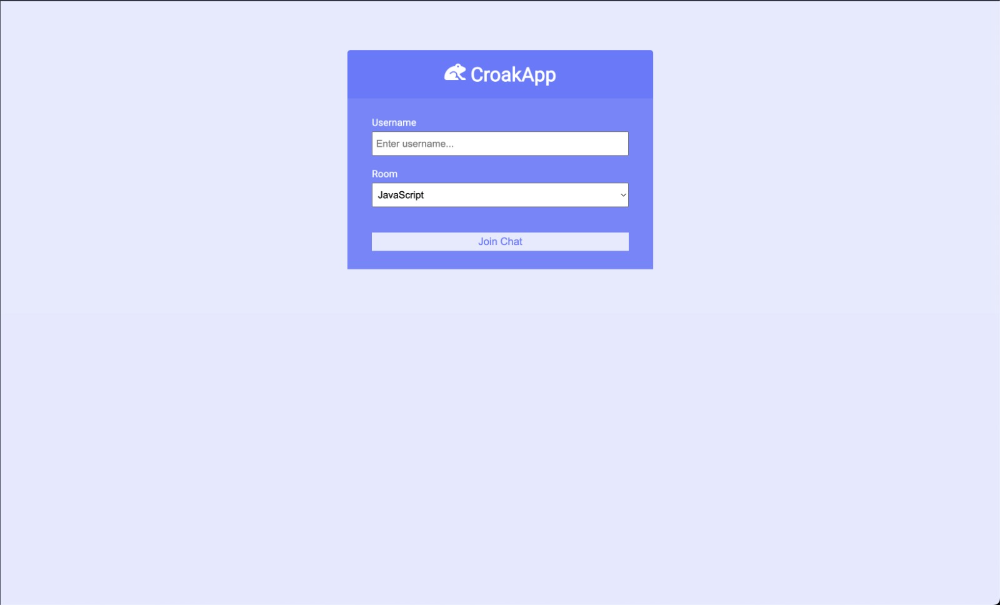

# < croak-app >

<fig>

<figcaption>The Croak App website home page</figcaption>
</fig>

# < smart-trails >

## introduction

> This project
> seems like the Discord platform. People can get into a specific chat, with their username, and chat about anything they want. All messages are instantaneous and observed live by the user on the other account.

It was built with the intension of using the socket.io, to practice and learn how instantaneous behavior would look like in a real project.

## Technical Analysis

The system is composed by a web interface built with HTML, CSS and JS. Main Features:

- **F1** - Home page -> Lets you choose your username and pick an specific room to get into.
- **F2** - Chat page -> Lets users communicate about anything in real time and leave the chat to go back to the home page and start the proccess again

The tools used to build this system was HTML,the most basic building block of the Web. It defines the meaning and structure of web content. Also, CSS: used to describe a web page's appearance/presentation. JavaScript: used to describe a web page's functionality/behavior. And, finally, Soket.io, which is a bidirectional and low-latency communication for the platform

### Functional Requirements

Respecting what was proposed, the system will attend the following requisites

- **RF1** - Code Legibility.
- **RF2** - Only HTML/CSS/JS.
- **RF3** - Commits.

## Basic concepts

- [JavaScript](https://developer.mozilla.org/en-US/docs/Web/JavaScript)
- [CSS](https://www.w3schools.com/css/)
- [HTML](https://www.w3schools.com/html/)
- [Git](https://git-scm.com/)
- [Socket](https://socket.io/)
